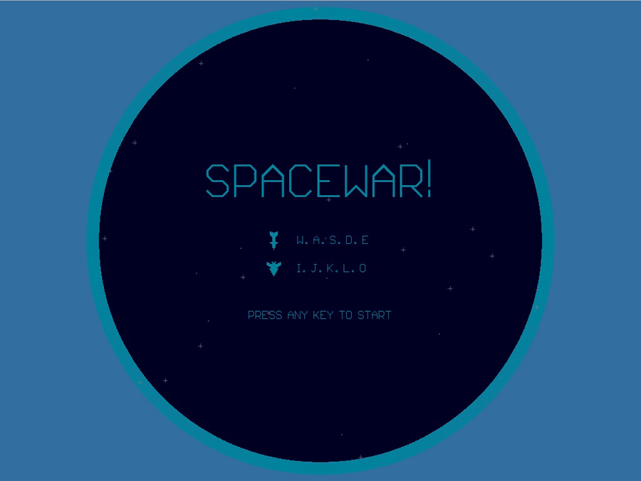

# Spacewar-Python3

Spacewar!(PDP-1)

Remake of the space combat video game developed in 1962 by Steve Russell

1.0 (2018 - two players, no AI, random asteroids, particle system, gravity)

2.0 (2018 - add ship inertion after launch torpeda, add planet, simple AI)

# Gameplay.

Use torpedoes to destroy enemy spaceship. Avoid the gravity well of a sun. Asteroids can't destroy spaceships. Hyperjump may chance to destroy spaceship.

# Controls.

Player 1:

W - forward

A - rotate left

D - rotate right

S - launch torpeda

E - hyperjump

Player 2:

I - forward

J - rotate left

L - rotate right

K - launch torpeda

O - hyperjump

